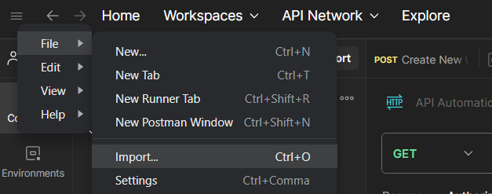

# Automation API Testing With Postman
Example of automated testing of API [gorest.co.in](https://gorest.co.in). Import [collection file](API%20Automation%20Test%20Cycle.postman_collection.json) through ``File > Import``

## Preconditions
1. [Register](https://gorest.co.in/consumer/login) at gorest.co.in
2. Get [API token](https://gorest.co.in/my-account/access-tokens) for further requests
3. Create enviroment variable ``{{authToken}}`` and copy the received token into it

